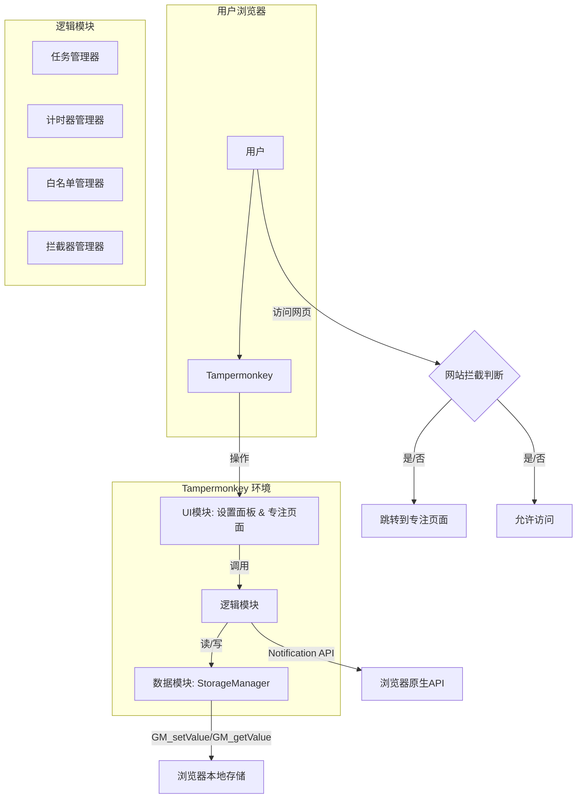
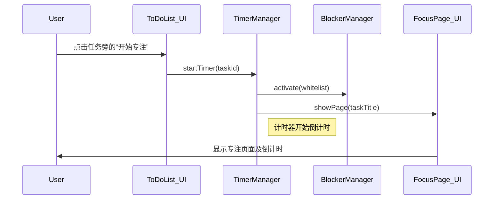

# **TomatoMonkey 全栈架构文档**

### **1. 简介**

本文档概述了 TomatoMonkey 项目的完整全栈架构。鉴于本项目是一个纯客户端的 Tampermonkey 脚本，这里的“全栈”指的是涵盖了数据（浏览器存储）、逻辑（核心功能模块）和视图（UI界面）的完整技术体系。本文档是开发工作的核心技术指南，旨在确保实现过程的结构清晰、代码高质量且易于维护。

#### **1.1 Starter Template or Existing Project**

N/A - 本项目为绿地（Greenfield）项目，将从零开始构建，不基于任何现有的启动模板。

#### **1.2 变更日志**

| 日期 | 版本 | 描述 | 作者 |
| :--- | :--- | :--- | :--- |
| 2025年9月8日 | 1.0 | 初始架构草稿创建 | Winston (Architect) |

### **2. 高层架构**

#### **2.1 技术摘要**

TomatoMonkey 的架构是一个纯粹的、模块化的客户端应用模型。它运行在浏览器内的 Tampermonkey 沙箱环境中，不依赖任何后端服务器。核心架构由UI管理器、多个功能逻辑模块（任务、计时器、拦截器等）以及一个与浏览器本地存储（通过`GM_*` API）交互的数据存储层组成。这种设计确保了应用的轻量、高效和零服务器成本，完全符合项目的核心需求。

#### **2.2 平台与基础设施**

  * **平台**: 用户桌面浏览器内置的 Tampermonkey 扩展环境。
  * **基础设施**: 无。所有计算和存储均在用户本地浏览器完成。

#### **2.3 仓库结构**

  * **结构**: 单一代码仓库 (Single Repository)。
  * **工具**: 无需复杂的 Monorepo 工具，使用标准 `git` 即可。

#### **2.4 高层架构图**



#### **2.5 架构与设计模式**

  * **模块化模式 (Module Pattern)**: 使用 ES6 模块将不同功能的代码（如 UI、任务逻辑、存储）分离到独立的文件中，以提高代码的可维护性和复用性。
  * **单例模式 (Singleton Pattern)**: 核心管理器（如 `TimerManager`）将以单例模式实现，确保在整个脚本生命周期中只有一个实例在运行。
  * **观察者模式 (Observer Pattern)**: UI 模块将观察核心逻辑模块的状态变化（如计时器更新），并在状态变化时自动更新视图。

### **3. 技术栈**

| 类别 | 技术 | 版本 | 目的 | 理由 |
| :--- | :--- | :--- | :--- | :--- |
| **语言** | JavaScript | ES6+ | 主要开发语言 | 浏览器原生支持，无需编译，轻量快捷。 |
| **UI库** | 无 (原生JS/CSS) | N/A | 构建用户界面 | 保持脚本轻量，避免引入大型框架的开销。 |
| **数据存储**| Tampermonkey API | `GM_setValue`, `GM_getValue` | 本地持久化数据 | Tampermonkey 提供的标准、可靠的跨会话存储方案。 |
| **图表库** | Chart.js | 4.x | 统计图表渲染 | 功能强大，社区成熟，且可以按需引入模块以保持轻量。 |
| **测试框架**| Jest | 29.x | 单元测试 | 用于测试纯逻辑模块，确保核心功能稳定。 |
| **格式化工具**| Prettier | 3.x | 代码风格统一 | 自动化代码格式，提升代码可读性和团队协作效率。 |
| **浏览器API**| Notification API | N/A | 桌面通知 | 实现系统级的番茄钟结束提醒。 |

### **4. 数据模型**

```typescript
// Task.ts
interface Task {
  id: string; // 使用UUID或时间戳生成
  title: string;
  isCompleted: boolean;
  createdAt: number; // 时间戳
  completedAt?: number; // 完成时的时间戳
  pomodoroCount: number; // 完成此任务所用的番茄数
}

// Settings.ts
interface Settings {
  pomodoroDuration: number; // 单位：分钟
  whitelist: string[];
}
```

### **5. 核心工作流：开始一个专注会话**



### **6. 数据库/存储设计**

数据将以 JSON 字符串的形式存储在 Tampermonkey 提供的键值存储中。

  * **Key**: `TOMATO_MONKEY_TASKS`
      * **Value**: `string` (序列化后的 `Task[]`)
  * **Key**: `TOMATO_MONKEY_SETTINGS`
      * **Value**: `string` (序列化后的 `Settings`)

### **7. 项目结构**

```plaintext
tomatomonkey-script/
├── src/
│   ├── components/       # UI组件（如设置面板、专注页面）
│   │   ├── settings-panel.js
│   │   └── focus-page.js
│   ├── core/             # 核心逻辑模块
│   │   ├── task-manager.js
│   │   ├── timer-manager.js
│   │   ├── whitelist-manager.js
│   │   ├── blocker-manager.js
│   │   ├── stats-manager.js
│   │   └── storage-manager.js
│   ├── utils/            # 通用工具函数 (如ID生成器)
│   └── styles/           # CSS样式文件
│       └── main.css
├── tests/                # Jest单元测试
│   └── core/
│       └── task-manager.spec.js
├── tomatomonkey.user.js  # Tampermonkey脚本主入口文件
└── package.json          # 项目依赖与脚本
```

### **8. 开发与部署**

  * **开发**: 开发者在本地修改 `src` 目录下的文件。使用一个简单的构建脚本（或手动）将所有 `js` 和 `css` 文件合并注入到 `tomatomonkey.user.js` 中，然后在浏览器中通过 Tampermonkey 加载本地文件进行调试。
  * **部署**: “部署”即发布最终的 `tomatomonkey.user.js` 文件。用户通过 Greasy Fork 或直接从代码仓库安装此脚本。

### **9. 安全与性能**

  * **安全**:
      * 所有数据存储在本地，无数据泄露到服务器的风险。
      * 所有用户输入（如任务标题）在渲染到页面时需进行HTML转义，以防止XSS。
  * **性能**:
      * 代码应保持轻量，避免使用大型库。
      * 网站拦截逻辑必须高效，避免在每个页面加载时造成可感知的延迟。应在 `document-start` 阶段执行匹配。

### **10. 测试策略**

  * **单元测试**: 使用 Jest 对 `src/core` 下的所有核心逻辑模块进行测试，覆盖所有业务规则和边界条件。
  * **手动端到端测试**: 在浏览器中手动测试完整的用户流程，包括UI交互、计时器、拦截和通知。

### **11. 编码标准**

  * **风格**: 使用 Prettier 进行自动格式化。
  * **注释**: 关键函数和复杂逻辑需使用 JSDoc 格式进行注释。
  * **命名**: 模块和函数名应清晰、自解释。
