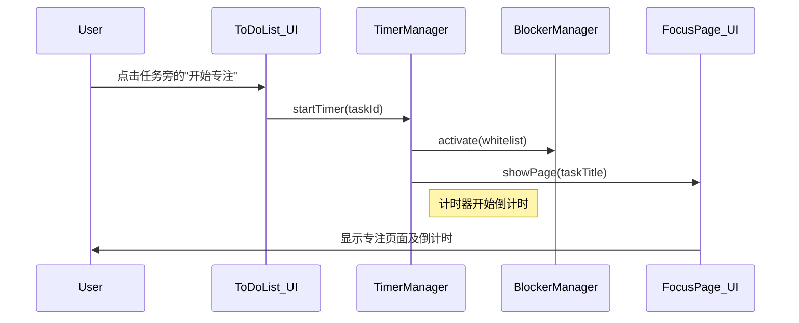

# 核心工作流：开始一个专注会话

```mermaid
sequenceDiagram
    participant User
    participant ToDoList_UI
    participant TimerManager
    participant BlockerManager
    participant FocusPage_UI

    User->>ToDoList_UI: 点击任务旁的"开始专注"
    ToDoList_UI->>TimerManager: startTimer(taskId)
    TimerManager->>BlockerManager: activate(whitelist)
    TimerManager->>FocusPage_UI: showPage(taskTitle)
    Note right of TimerManager: 计时器开始倒计时
    FocusPage_UI->>User: 显示专注页面及倒计时
```