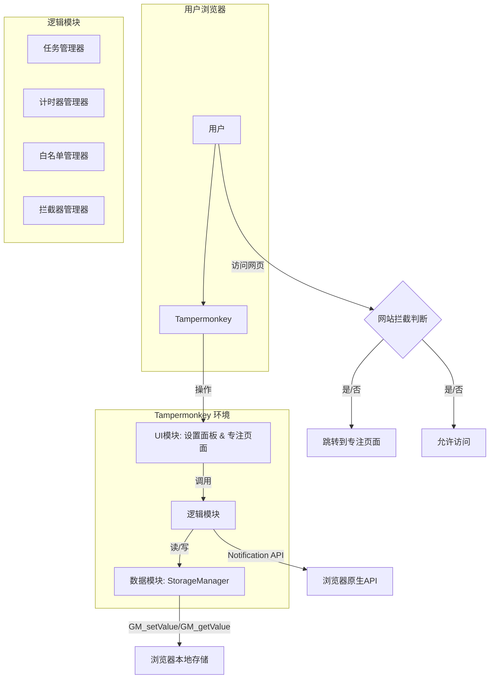

# 高层架构

## 2.1 技术摘要

TomatoMonkey 的架构是一个纯粹的、模块化的客户端应用模型。它运行在浏览器内的 Tampermonkey 沙箱环境中，不依赖任何后端服务器。核心架构由UI管理器、多个功能逻辑模块（任务、计时器、拦截器等）以及一个与浏览器本地存储（通过`GM_*` API）交互的数据存储层组成。这种设计确保了应用的轻量、高效和零服务器成本，完全符合项目的核心需求。

## 2.2 平台与基础设施

- **平台**: 用户桌面浏览器内置的 Tampermonkey 扩展环境。
- **基础设施**: 无。所有计算和存储均在用户本地浏览器完成。

## 2.3 仓库结构

- **结构**: 单一代码仓库 (Single Repository)。
- **工具**: 无需复杂的 Monorepo 工具，使用标准 `git` 即可。

## 2.4 高层架构图

## 2.5 架构与设计模式

- **模块化模式 (Module Pattern)**: 使用 ES6 模块将不同功能的代码（如 UI、任务逻辑、存储）分离到独立的文件中，以提高代码的可维护性和复用性。
- **单例模式 (Singleton Pattern)**: 核心管理器（如 `TimerManager`）将以单例模式实现，确保在整个脚本生命周期中只有一个实例在运行。
- **观察者模式 (Observer Pattern)**: UI 模块将观察核心逻辑模块的状态变化（如计时器更新），并在状态变化时自动更新视图。
