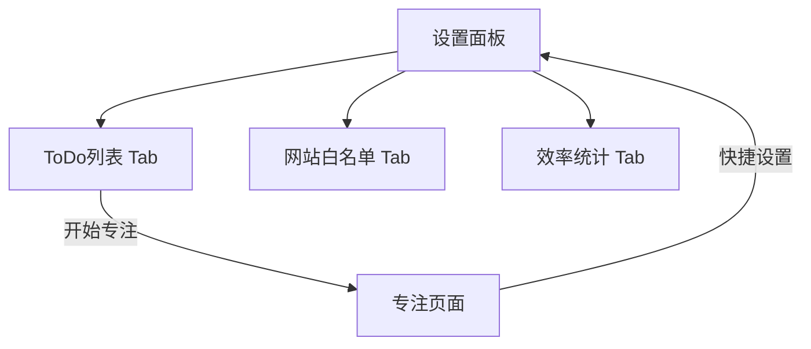

# **TomatoMonkey UI/UX 规范**

### **1. 简介**

[cite\_start]本文档定义了 TomatoMonkey项目的用户体验目标、信息架构、用户流程和视觉设计规范 [cite: 676][cite\_start]。 它将作为视觉设计和前端开发的基石，确保为用户提供一个内聚的、以用户为中心的体验 [cite: 677]。

#### **1.1 整体UX目标与原则**

- [cite\_start]**目标用户画像** [cite: 681]
  - **高效学习者**: 包括学生和研究人员，他们需要一个无干扰的环境来专注于学习和研究任务。
  - **深度工作者**: 包括程序员、设计师和作家，他们需要长时间的专注来完成复杂的创造性工作。
  - **效率办公族**: 希望通过番茄工作法来提升日常办公任务节奏和效率的白领。
- [cite\_start]**可用性目标** [cite: 683]
  - **易学性**: 新用户在首次使用时，能在2分钟内理解核心功能并成功启动第一个番茄钟。
  - **效率**: 高频用户可以以最少的点击次数完成任务创建、启动专注等核心操作。
  - **容错性**: 界面提供清晰的引导和确认，防止用户误操作（如误删任务）。
- [cite\_start]**设计原则** [cite: 684]
  - **专注第一**: 任何设计元素都不能喧宾夺主，避免产生新的视觉干扰。
  - **清晰直观**: 功能和交互逻辑一目了然，无需用户思考。
  - **即时反馈**: 用户的每一次操作都应有清晰、即时的视觉反馈。
  - **保持轻量**: 保持脚本的轻量化特性，界面加载快，响应迅速。

#### **1.2 变更日志**

| 日期         | 版本 | 描述                | 作者              |
| :----------- | :--- | :------------------ | :---------------- |
| 2025年9月8日 | 1.0  | 基于PRD创建初始草稿 | Sally (UX-Expert) |

### **2. 信息架构 (IA)**

#### **2.1 站点地图 / 屏幕清单**



#### **2.2 导航结构**

- [cite\_start]**主导航**: 设置面板内部的左侧垂直标签页构成了应用的主导航，允许用户在三个核心功能区之间切换 [cite: 692]。
- **上下文导航**: 从“专注页面”提供返回“设置面板”的快捷入口，方便用户在专注期间进行必要调整。

### **3. 用户流程**

#### **3.1 核心流程：创建任务并开始专注**

- [cite\_start]**用户目标**: 用户希望快速选定一个任务，并立即开始一个番茄专注时钟 [cite: 695]。
- **流程图**:

  ```mermaid
  sequenceDiagram
      participant U as 用户
      participant SP as 设置面板
      participant FP as 专注页面

      U->>SP: 打开“ToDo列表”标签页
      U->>SP: 输入新任务并添加
      U->>SP: 点击任务旁的“开始专注”按钮
      SP->>FP: 跳转到专注页面
      FP->>U: 显示当前任务和倒计时
      Note right of U: 用户开始专注工作
  ```

- **边缘情况与错误处理**:
  - 如果用户未选择任何任务就尝试开始专注，按钮应为禁用状态或给出提示。
  - 如果浏览器不支持桌面通知，应在设置中优雅地提示用户。

### **4. 线框图与原型**

- **主要设计文件**: 详细的高保真原型将在 Figma 中进行设计（链接待定），此处提供低保真线框图以明确布局和核心元素。
- **核心界面布局**:
  - **设置面板**:
    - [cite\_start]**目的**: 集中管理所有功能 [cite: 700]。
    - [cite\_start]**关键元素**: 左侧垂直导航（ToDo/白名单/统计）、右侧内容区、任务输入框、列表区域、图表区域 [cite: 700]。
    - [cite\_start]**交互说明**: 点击左侧标签页，右侧内容区即时切换，无页面刷新。列表操作（增、删、改）应有即时反馈 [cite: 700]。
  - **专注页面**:
    - **目的**: 提供一个无干扰的计时和任务提醒界面。
    - **关键元素**: 当前任务标题、大字体显示的倒计时、提前完成/放弃按钮、设置快捷入口。
    - **交互说明**: 页面元素极简，居中布局，避免任何不必要的视觉干扰。

### **5. 组件库 / 设计系统**

- [cite\_start]**设计系统**: 采用原子化设计思路，构建一套可复用的基础组件 [cite: 702]。
- [cite\_start]**核心组件清单**[cite: 705]:
  - **按钮**: 主要按钮（如“添加任务”、“开始专注”）、次要/文本按钮（如“删除”）。状态包括：默认、悬停、点击、禁用。
  - **输入框**: 用于任务和白名单输入。状态包括：默认、获取焦点、错误提示。
  - **复选框**: 用于标记任务完成。
  - **标签页 (Tabs)**: 用于在设置面板中切换。
  - **图表容器**: 用于展示统计图表。

### **6. 品牌与风格指南**

#### [cite\_start]**6.1 调色板** [cite: 707]

- **主色 (Primary)**: `#D95550` (番茄红)，用于关键操作、计时器等。
- **辅助色 (Accent)**: `#70A85C` (绿色)，用于完成状态、成功提示。
- **中性色 (Neutral)**: `#FFFFFF` (背景)、`#F5F5F5` (浅灰背景)、`#666666` (正文)、`#BBBBBB` (次要文字/边框)。
- **警告/错误色 (Error)**: `#E53935`，用于删除确认等。

#### [cite\_start]**6.2 字体排印** [cite: 708]

- **字体**: 使用无衬线字体，如 "Inter", "Lato", "Helvetica Neue", "Arial", sans-serif，确保在各种屏幕上的可读性。
- **字号体系**:
  - H1 (页面标题): 24px
  - H2 (模块标题): 18px
  - Body (正文/列表项): 14px
  - 倒计时数字: 72px (粗体)

### **7. 无障碍性 (Accessibility)**

- [cite\_start]**合规目标**: 核心功能满足 WCAG 2.1 AA 级别标准 [cite: 714]。
- **关键要求**:
  - [cite\_start]**视觉**: 所有文本和背景的颜色对比度不低于 4.5:1。所有可交互组件都有清晰的焦点状态（Focus Indicator） [cite: 715]。
  - [cite\_start]**交互**: 所有功能均可通过键盘操作。动态内容（如倒计时）能被屏幕阅读器正确识别 [cite: 715]。

### **8. 响应式策略**

- [cite\_start]**断点**: 由于目标是桌面浏览器，主要考虑不同窗口尺寸下的布局适应性，而非移动端优先 [cite: 717]。
  - 标准桌面: \> 1200px
  - 小桌面/笔记本: 992px - 1199px
- **适配模式**: 采用流式布局，确保在用户缩放浏览器窗口时，内容能优雅地重排，避免出现横向滚动条。

### **9. 动画与微交互**

- [cite\_start]**动效原则**: 动画应服务于功能，提供反馈，而非单纯为了装饰。所有动效都应快速且有意义（例如，任务完成时平滑地移动到底部） [cite: 720]。
- **关键动效**:
  - **状态切换**: 按钮悬停/点击时的微妙变化。
  - **列表操作**: 添加/删除任务时的淡入淡出效果。

### **10. 性能考量**

- [cite\_start]**性能目标**: 作为一个轻量级脚本，设置面板的加载和交互不应有任何可感知的延迟 [cite: 721, 722]。
- **设计策略**: 避免使用高清图片或复杂的背景效果。图表库应按需加载，以加快初始渲染速度。
