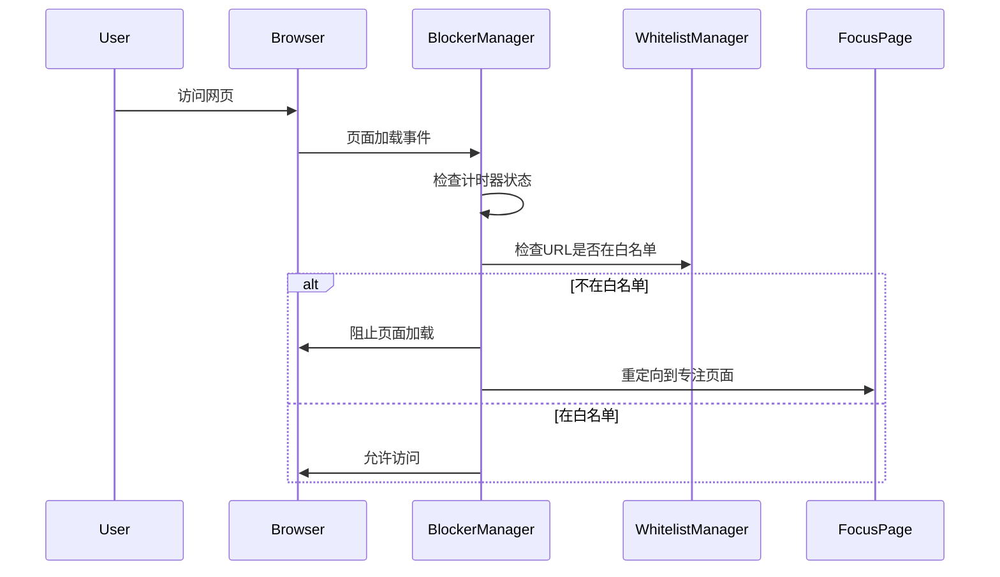

# Story 1.4: 网站拦截逻辑实现

## Status

Draft

## Story

**As a** 需要专注的用户,
**I want** 在番茄钟运行时自动屏蔽无关网站,
**so that** 我能免受干扰。

## Acceptance Criteria

1. 当番茄钟正在运行时，在任何标签页中尝试访问不在白名单中的网址，都会被拦截。
2. 被拦截后，该标签页会自动跳转到"专注页面"。
3. "专注页面"上提供"提前完成"和"放弃"任务的按钮。
4. "专注页面"右上角有一个设置图标，点击可以打开设置面板。

## Tasks / Subtasks

- [ ] Task 1: 创建 BlockerManager 拦截器模块 (AC: 1, 2)
  - [ ] Subtask 1.1: 在 `src/core/blocker-manager.js` 中创建 BlockerManager 单例类
  - [ ] Subtask 1.2: 实现拦截器的激活和停用方法
  - [ ] Subtask 1.3: 实现 URL 匹配检查逻辑（调用 WhitelistManager）
  - [ ] Subtask 1.4: 实现页面拦截和重定向逻辑
  - [ ] Subtask 1.5: 处理不同的页面加载场景（新标签页、页面跳转、刷新）
  - [ ] Subtask 1.6: 确保拦截器只在计时器运行时激活

- [ ] Task 2: 集成 Tampermonkey 页面拦截机制 (AC: 1, 2)
  - [ ] Subtask 2.1: 在主入口文件配置 `@run-at document-start` 元数据
  - [ ] Subtask 2.2: 实现早期页面拦截逻辑（在页面加载前检查）
  - [ ] Subtask 2.3: 监听页面 URL 变化（处理单页应用）
  - [ ] Subtask 2.4: 实现跨标签页的状态同步机制
  - [ ] Subtask 2.5: 处理 iframe 和嵌入内容的拦截

- [ ] Task 3: 扩展专注页面功能 (AC: 3, 4)
  - [ ] Subtask 3.1: 在专注页面添加"提前完成"按钮
  - [ ] Subtask 3.2: 在专注页面添加"放弃任务"按钮
  - [ ] Subtask 3.3: 添加设置图标到右上角
  - [ ] Subtask 3.4: 实现按钮的事件处理器
  - [ ] Subtask 3.5: 实现设置面板的弹出/嵌入逻辑
  - [ ] Subtask 3.6: 更新专注页面样式以容纳新元素

- [ ] Task 4: 实现拦截状态管理 (AC: 1)
  - [ ] Subtask 4.1: 创建拦截器状态存储机制
  - [ ] Subtask 4.2: 跨标签页同步拦截器状态
  - [ ] Subtask 4.3: 处理浏览器标签页的生命周期事件
  - [ ] Subtask 4.4: 确保拦截器状态与计时器状态同步

- [ ] Task 5: 优化拦截性能 (AC: 1)
  - [ ] Subtask 5.1: 实现白名单缓存机制
  - [ ] Subtask 5.2: 优化 URL 匹配算法
  - [ ] Subtask 5.3: 减少拦截检查的性能开销
  - [ ] Subtask 5.4: 实现智能预加载专注页面

- [ ] Task 6: 边缘情况处理
  - [ ] Subtask 6.1: 处理专注页面本身的拦截豁免
  - [ ] Subtask 6.2: 处理浏览器扩展页面和系统页面
  - [ ] Subtask 6.3: 处理文件协议（file://）URL
  - [ ] Subtask 6.4: 处理重定向循环防护

- [ ] Task 7: 创建测试
  - [ ] Subtask 7.1: 在 `tests/core/blocker-manager.spec.js` 中创建单元测试
  - [ ] Subtask 7.2: 测试 URL 匹配逻辑
  - [ ] Subtask 7.3: 测试拦截器激活/停用
  - [ ] Subtask 7.4: 手动测试跨标签页拦截功能

## Dev Notes

### Previous Story Insights

从已完成的故事中获得的基础：

- Story 1.1: 设置面板框架，TodoList 功能
- Story 1.2: WhitelistManager 实现，包含通配符匹配逻辑
- Story 1.3: TimerManager 实现，专注页面基础 UI

本故事需要：

- 深度集成 TimerManager 和 WhitelistManager
- 扩展专注页面以添加控制按钮
- 实现 Tampermonkey 的页面拦截能力

### Core Workflow Integration

**拦截流程** [Source: architecture.md#核心工作流]:



### Component Specifications

**专注页面扩展设计** [Source: front-end-spec.md#核心界面布局]:

- 添加控制按钮区域（提前完成、放弃任务）
- 右上角设置图标（齿轮图标）
- 保持极简设计原则，避免视觉干扰

**按钮规范** [Source: front-end-spec.md#核心组件清单]:

- **提前完成按钮**: 次要按钮样式，绿色辅助色 `#70A85C`
- **放弃任务按钮**: 文本按钮样式，警告色 `#E53935`
- **设置图标**: 灰色图标 `#BBBBBB`，悬停时变为主色 `#D95550`

### File Locations

**项目结构** [Source: architecture.md#项目结构]:

```
src/
├── core/
│   └── blocker-manager.js     # 拦截器管理器（新建）
├── components/
│   └── focus-page.js          # 扩展以添加控制按钮
└── styles/
    └── focus-page.css         # 更新样式
tests/
└── core/
    └── blocker-manager.spec.js # 拦截器测试（新建）
```

### Technical Constraints

**Tampermonkey 元数据要求**:

```javascript
// @run-at       document-start
// @match        *://*/*
// @grant        GM_setValue
// @grant        GM_getValue
// @grant        GM_addValueChangeListener
```

**架构模式** [Source: architecture.md#架构与设计模式]:

- BlockerManager 以单例模式实现
- 与 TimerManager 和 WhitelistManager 协同工作
- 使用观察者模式监听计时器状态变化

**性能要求** [Source: architecture.md#安全与性能]:

- 网站拦截逻辑必须高效，避免在每个页面加载时造成可感知的延迟
- 应在 `document-start` 阶段执行匹配，尽早拦截

**拦截策略**:

- 在 `document-start` 阶段进行 URL 检查
- 使用 `window.location.replace()` 进行重定向（不产生历史记录）
- 缓存白名单匹配结果以提高性能
- 专注页面 URL 必须始终被豁免

**跨标签页同步**:

- 使用 `GM_addValueChangeListener` 监听状态变化
- 所有标签页共享同一个计时器状态
- 拦截器状态必须实时同步

**边缘情况处理**:

- 浏览器扩展页面（chrome://、about:、moz-extension://）
- 本地文件（file://）
- 专注页面自身的豁免
- 防止重定向循环

### Testing Requirements

**测试策略** [Source: architecture.md#测试策略]:

- 单元测试 BlockerManager 的核心逻辑
- 手动端到端测试拦截功能

**测试场景**:

- URL 匹配测试：
  - 精确域名匹配
  - 通配符匹配
  - 子域名处理
  - 路径和查询参数处理
- 拦截激活测试：
  - 计时器运行时激活
  - 计时器停止时停用
  - 跨标签页同步
- 重定向测试：
  - 正常重定向
  - 循环防护
  - 特殊页面豁免
- 性能测试：
  - 拦截检查延迟
  - 内存使用
  - CPU 占用

**手动测试要点**:

1. 开启计时器后访问非白名单网站
2. 测试多标签页同时拦截
3. 测试刷新页面时的拦截
4. 测试单页应用的 URL 变化拦截
5. 测试设置面板的打开/关闭

## Change Log

| Date       | Version | Description            | Author   |
| ---------- | ------- | ---------------------- | -------- |
| 2025-09-08 | 1.0     | Initial story creation | Bob (SM) |

## Dev Agent Record

### Agent Model Used

_To be filled by dev agent_

### Debug Log References

_To be filled by dev agent_

### Completion Notes List

_To be filled by dev agent_

### File List

_To be filled by dev agent_

## QA Results

_To be filled by QA agent_
