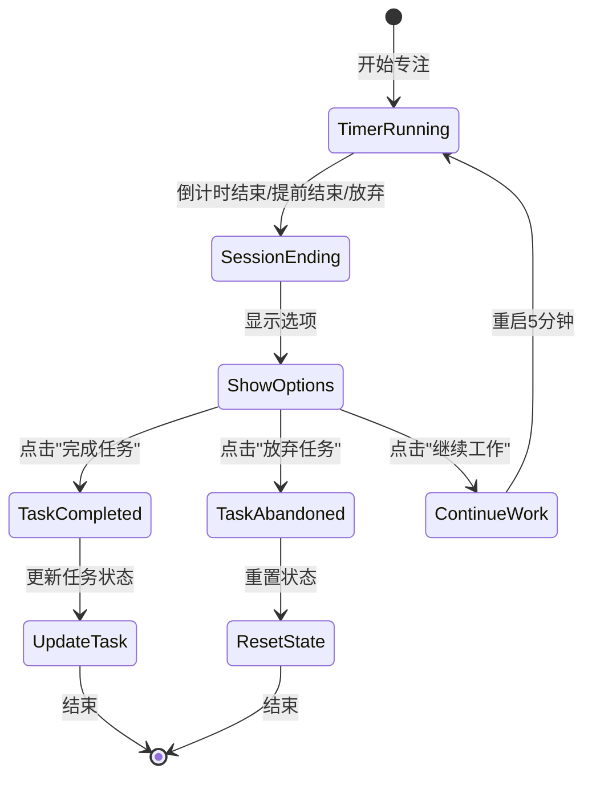

# Story 1.5: 会话结束流程

## Status

Draft

## Story

**As a** 需要专注的用户,
**I want** 在专注结束后明确地处理我的任务,
**so that** 我的任务状态得到正确更新。

## Acceptance Criteria

1. 当番茄钟倒计时结束或用户点击"提前完成"/"放弃"时，倒计时停止。
2. 页面上出现选项："完成任务"、"放弃任务"、"继续工作5分钟"。
3. 点击"完成任务"，对应任务状态变为"已完成"，并记录本次番茄钟时间。
4. 点击"放弃任务"，任务状态不变，不记录时间。
5. 点击"继续工作"，计时器重置为5分钟并重新开始。
6. 用户做出选择后，专注流程结束。

## Tasks / Subtasks

- [ ] Task 1: 扩展 TimerManager 支持会话结束处理 (AC: 1, 5)
  - [ ] Subtask 1.1: 添加计时器完成状态的处理逻辑
  - [ ] Subtask 1.2: 实现"提前完成"方法 (completeEarly)
  - [ ] Subtask 1.3: 实现"放弃任务"方法 (abandonTask)
  - [ ] Subtask 1.4: 实现"继续工作"方法 (continueWork)
  - [ ] Subtask 1.5: 添加短时间模式支持（5分钟继续工作）
  - [ ] Subtask 1.6: 确保状态转换的原子性和一致性

- [ ] Task 2: 创建会话结束 UI 组件 (AC: 2)
  - [ ] Subtask 2.1: 在专注页面添加会话结束选项区域
  - [ ] Subtask 2.2: 创建三个选项按钮（完成任务、放弃任务、继续工作）
  - [ ] Subtask 2.3: 实现选项区域的显示/隐藏逻辑
  - [ ] Subtask 2.4: 添加选项区域的样式设计
  - [ ] Subtask 2.5: 实现按钮的视觉反馈效果

- [ ] Task 3: 实现任务完成逻辑 (AC: 3)
  - [ ] Subtask 3.1: 在 TaskManager 中添加完成任务的方法
  - [ ] Subtask 3.2: 更新任务的 completedAt 时间戳
  - [ ] Subtask 3.3: 增加任务的 pomodoroCount 计数
  - [ ] Subtask 3.4: 触发任务列表的重新排序
  - [ ] Subtask 3.5: 保存更新后的任务数据到存储

- [ ] Task 4: 实现任务放弃逻辑 (AC: 4)
  - [ ] Subtask 4.1: 记录放弃事件（用于未来统计）
  - [ ] Subtask 4.2: 重置计时器状态
  - [ ] Subtask 4.3: 停用拦截器
  - [ ] Subtask 4.4: 返回到设置面板或关闭专注页面

- [ ] Task 5: 实现继续工作逻辑 (AC: 5)
  - [ ] Subtask 5.1: 重置计时器为5分钟
  - [ ] Subtask 5.2: 保持当前任务上下文
  - [ ] Subtask 5.3: 继续激活拦截器
  - [ ] Subtask 5.4: 更新 UI 显示新的倒计时
  - [ ] Subtask 5.5: 处理连续工作会话的统计

- [ ] Task 6: 集成会话结束流程 (AC: 1, 6)
  - [ ] Subtask 6.1: 连接"提前完成"按钮到结束流程
  - [ ] Subtask 6.2: 连接"放弃任务"按钮到结束流程
  - [ ] Subtask 6.3: 连接计时器自然结束到结束流程
  - [ ] Subtask 6.4: 实现用户选择后的页面跳转逻辑
  - [ ] Subtask 6.5: 清理会话相关的临时数据

- [ ] Task 7: 数据统计准备 (AC: 3)
  - [ ] Subtask 7.1: 创建会话记录数据结构
  - [ ] Subtask 7.2: 记录每次专注会话的详细信息
  - [ ] Subtask 7.3: 为 Story 1.6 的统计功能准备数据
  - [ ] Subtask 7.4: 实现会话数据的持久化存储

- [ ] Task 8: 创建测试
  - [ ] Subtask 8.1: 测试各种结束场景的状态转换
  - [ ] Subtask 8.2: 测试任务完成的数据更新
  - [ ] Subtask 8.3: 测试继续工作的计时器重置
  - [ ] Subtask 8.4: 手动测试完整的会话结束流程

## Dev Notes

### Previous Story Insights

从已完成的故事中获得的基础：

- Story 1.1: TaskManager 实现，任务状态管理
- Story 1.3: TimerManager 实现，计时器核心功能
- Story 1.4: 专注页面已有"提前完成"和"放弃"按钮

本故事需要：

- 扩展 TimerManager 和 TaskManager 的交互
- 完善专注页面的会话结束 UI
- 建立数据统计的基础

### Data Models

**扩展 Task 数据模型** [Source: architecture.md#数据模型]:

```typescript
interface Task {
  id: string;
  title: string;
  isCompleted: boolean;
  createdAt: number;
  completedAt?: number; // 完成时的时间戳
  pomodoroCount: number; // 完成此任务所用的番茄数
}

// 新增：会话记录模型
interface SessionRecord {
  id: string;
  taskId: string;
  taskTitle: string;
  startTime: number;
  endTime: number;
  duration: number; // 实际专注时长（秒）
  plannedDuration: number; // 计划时长（秒）
  outcome: "completed" | "abandoned" | "continued";
  isTaskCompleted: boolean; // 任务是否在此会话完成
}
```

### User Flow

**会话结束流程**:



### Component Specifications

**会话结束选项 UI** [Source: front-end-spec.md#核心界面布局]:

- 选项区域应在倒计时区域下方
- 使用卡片式布局展示三个选项
- 每个选项应有清晰的图标和说明文字

**按钮设计规范** [Source: front-end-spec.md#核心组件清单]:

- **完成任务按钮**:
  - 主要按钮样式
  - 使用辅助色 `#70A85C` (绿色)
  - 包含勾选图标
- **放弃任务按钮**:
  - 次要按钮样式
  - 使用中性色 `#BBBBBB`
  - 包含X图标
- **继续工作按钮**:
  - 主要按钮样式
  - 使用主色 `#D95550` (番茄红)
  - 包含时钟图标

**交互反馈** [Source: front-end-spec.md#设计原则]:

- 用户的每一次操作都应有清晰、即时的视觉反馈
- 按钮点击后应有加载状态
- 状态转换应有平滑的过渡动画

### File Locations

**项目结构** [Source: architecture.md#项目结构]:

```
src/
├── core/
│   ├── task-manager.js        # 扩展以支持任务完成
│   ├── timer-manager.js       # 扩展以支持会话结束
│   └── stats-manager.js       # 新建：统计管理器（为1.6准备）
├── components/
│   └── focus-page.js          # 扩展以添加会话结束UI
└── styles/
    └── focus-page.css         # 更新样式
```

### Technical Constraints

**状态管理要求**:

- 会话结束状态必须是明确的，避免中间状态
- 防止重复点击导致的多次处理
- 确保数据更新的原子性

**用户体验要求**:

- 选项出现应有平滑的动画
- 用户选择后应有明确的反馈
- 防止误操作（如双击）

**数据一致性**:

- 任务完成状态必须正确持久化
- 番茄计数必须准确
- 会话记录必须完整

**边缘情况处理**:

- 页面刷新时的状态恢复
- 网络断开时的本地存储
- 多标签页的状态同步
- 防止数据丢失

### Testing Requirements

**测试策略** [Source: architecture.md#测试策略]:

- 单元测试会话结束的各种路径
- 集成测试数据更新的正确性
- 手动测试用户交互流程

**测试场景**:

1. **正常完成流程**:
   - 倒计时自然结束 → 选择完成 → 任务标记完成
   - 提前完成 → 选择完成 → 任务标记完成
2. **放弃流程**:
   - 点击放弃 → 选择放弃任务 → 任务状态不变
   - 倒计时结束 → 选择放弃 → 任务状态不变
3. **继续工作流程**:
   - 倒计时结束 → 选择继续 → 5分钟计时器
   - 连续多次继续工作
4. **数据验证**:
   - pomodoroCount 正确增加
   - completedAt 时间戳正确
   - 会话记录完整保存
5. **边界条件**:
   - 快速连续点击
   - 页面刷新恢复
   - 跨标签页同步

## Change Log

| Date       | Version | Description            | Author   |
| ---------- | ------- | ---------------------- | -------- |
| 2025-09-08 | 1.0     | Initial story creation | Bob (SM) |

## Dev Agent Record

### Agent Model Used

_To be filled by dev agent_

### Debug Log References

_To be filled by dev agent_

### Completion Notes List

_To be filled by dev agent_

### File List

_To be filled by dev agent_

## QA Results

_To be filled by QA agent_
